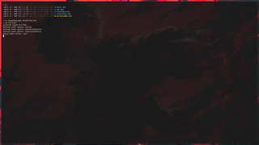
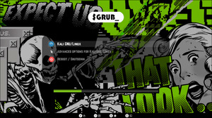
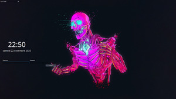
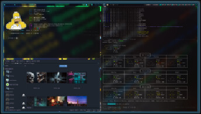
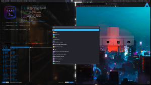
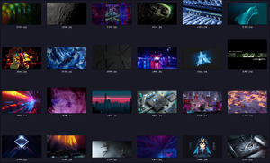

> This repository contains my personal dotfiles for my Arch setup. It is customized for the Hyprland desktop environment.

    Window manager: Hyprland
    Wallpaper manager: script for random
    Panel: Waybar
    Shell: Ohmyzsh
    Prompt: oh-my-posh
    Terminal: Kitty, Foot
    Window manager: sddm-greeter
    Notification manager: Dunst
<<<<<<< HEAD
    File manager: PcmanFL, Yazi
    Menu: Wofi
    Web browser: OPera
=======
    File manager: Dolphin, Yazi
    Menu: Wofi
    Web browser: Firefox
>>>>>>> f1b01dff3b3b14ddcac34178cb4fbf0abf068473
    Screenshot: Grim 
    Text editor: Sublime Text
    

Theme for Grub: Dedsec
https://github.com/VandalByte/dedsec-grub2-theme

sddm-greeter : abstractdark-sddm-theme
https://github.com/3ximus/abstractdark-sddm-theme

  
  

## Miniatures

  
  

## Cloud

<<<<<<< HEAD
  <a href="https://mega.nz/folder/z34hjAzb#nbCFv5Nnumm0-K_hcTTKXQ">My Wallpapers on Cloud</a>
=======
  <a href="https://mega.nz/folder/7nRlhLYQ#q5W2EFLTmvQmzL3ZCyqINQ">My Wallpapers on Cloud</a>
>>>>>>> f1b01dff3b3b14ddcac34178cb4fbf0abf068473

